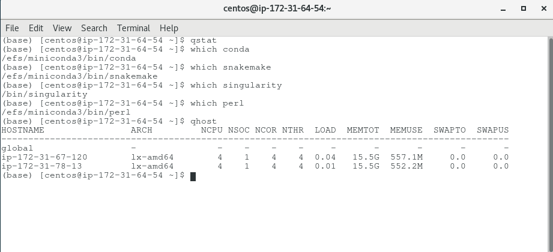
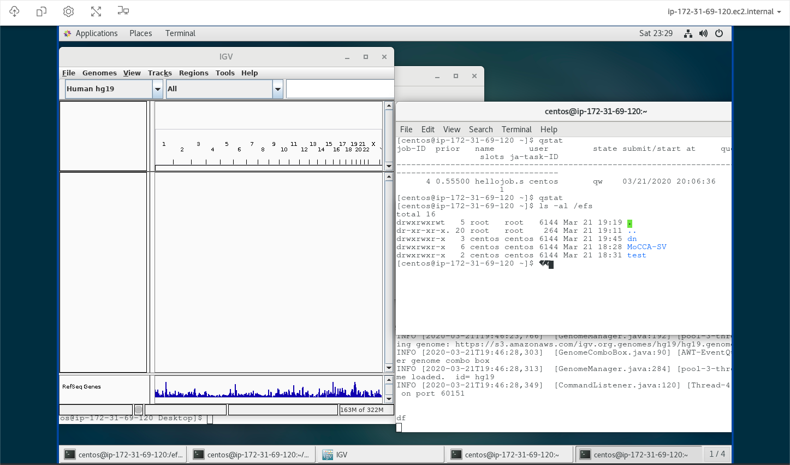

# Deployment of MoCCA-SV snakemake pipeline at AWS ParallelCluster
---
## Overview
___
### Description
This tutorial is to guide you to deploy [MoCCA-SV snakemake pipeline](https://github.com/NCI-CGR/MoCCA-SV) to AWS. We first demonstrate how to launch a SGE HPC cluster at AWS using AWS ParallelCluster, and then how to deploy the MoCCA-SV pipeline on the SGE cluster.

### Dependencies
In this tutorial, you need have admin permission in your AWS account. You should have basic AWS knowledge in configuring VPC, safety group, EC2 instance, EFS and etc.
 
### Architecture
We are going to launch a ***login node*** first and create an ***EFS*** first.  After installing essential components required by the pipeline on EFS, we then create a SGE cluster from the login node, consisting of one ***master node*** and two ***worker nodes***.  Finally, remotely access the master node to run the pipeline.    

___

## Instructions
### 1. Launch an EC2 instance as the login node and install AWS ParallelCluster. 
Most EC2 instances can be used to install AWS ParallelCluster. In our case, we launch an EC2 *t2.mciro* instance (amzn2-ami-hvm-2.0.20200304.0-x86_64-gp2: ami-0fc61db8544a617ed) as the login node, and we follow [this AWS instruction](https://docs.aws.amazon.com/parallelcluster/latest/ug/install-virtualenv.html) to install AWS ParallelCluster in a virtual environment, under the directory ***~/apc-ve***.

After you have done with the AWS ParallelCluster installation, you may confirm your success as below.
```bash
source ~/apc-ve/bin/activate

pcluster version
# 2.6.0
```

### 2. Create an EFS
It is simple to create a new EFS, and it is also fine to use an existing EFS instead.  Please make sure to add rule to the safety group, so as to open NFS port 2049 to allow inbound traffic from the login node and the SGE cluster to the EFS.  The detailed instruction is described [here](https://docs.aws.amazon.com/efs/latest/ug/accessing-fs-create-security-groups.html).  

You may test to mount the EFS storage to your login node to /efs: 
```bash
sudo mkdir /efs
mount -t nfs4 -o nfsvers=4.1,rsize=1048576,wsize=1048576,hard,timeo=30,retrans=2,noresvport,_netdev fs-XXXXXXXX.efs.us-east-1.amazonaws.com:/ /efs 
```
And move to the next step if your EFS mounting is successful. 

### 3. Pre-install MoCCA-SV dependencies to /efs
[Python, snakemake, perl and singularity](https://github.com/NCI-CGR/MoCCA-SV#ii--dependencies) are  required to run MoCCA-SV.  We need have them installed in the SGE cluster to be launched, including both the master node and the worker nodes.  There are several way to achieve it.  One way is [Building a Custom AWS ParallelCluster AMI](https://docs.aws.amazon.com/parallelcluster/latest/ug/tutorials_02_ami_customization.html), which, however, is not ideal as updating is a common scenario in AWS. The preferred way is to [use post-install actions](https://docs.aws.amazon.com/parallelcluster/latest/ug/pre_post_install.html) called after cluster bootstrap is complete. We are going to take the preferred way in this tutorial, with a little modification.  

To save time, we pre-install some of the required modules to /efs via conda. Briefly, we are going to install conda under /efs/miniconda3 and activate the conda installation in the bootstrap script later. In this way, it also saves disk space in the master/worker nodes.  

```bash
mkdir -p /efs/dn
cd /efs/dn
sudo yum install -y perl wget libtool

wget https://repo.continuum.io/miniconda/Miniconda3-latest-Linux-x86_64.sh

### install conda in batch mode 
sh Miniconda3-latest-Linux-x86_64.sh -b -f -p /efs/miniconda3
source ~/.bash_profile

conda --version
# conda 4.8.2

which conda
# /efs/miniconda3/bin/conda

### Install singularity (3.5.3-1.1.el7)
sudo yum update -y && \
    sudo yum install -y epel-release && \
    sudo yum update -y && \
    sudo yum install -y singularity

singularity --version
#singularity version 3.5.3-1.1.el7

### Install snakemake and perl 
# installation of snakemake is very slow
conda install -y -c bioconda -c conda-forge snakemake

conda install -y -c bioconda perl-app-cpanminus pysam
conda install -y -c anaconda gcc_linux-64
cpanm Capture::Tiny List::MoreUtils YAML::Tiny Array::Diff

snakemake --version
# 5.11.2

which perl
# /efs/miniconda3/bin/perl

perl --version

# This is perl 5, version 26, subversion 2 (v5.26.2) built for x86_64-linux-thread-multi

# Copyright 1987-2018, Larry Wall

# Perl may be copied only under the terms of either the Artistic License or the
# GNU General Public License, which may be found in the Perl 5 source kit.

# Complete documentation for Perl, including FAQ lists, should be found on
# this system using "man perl" or "perldoc perl".  If you have access to the
# Internet, point your browser at http://www.perl.org/, the Perl Home Page.


### Check the spaced used by the conda installation
du -hs /efs/miniconda3/
# 4.0G    /efs/miniconda3/
```

We noticed that the singularity version installed by conda cannot work well with the snakemake pipeline. So we put its installation in the bootstrap script, as described in the section below. 

### 4. Install MoCCA-SV pipeline
The details of the MoCCA-SV pipeline is available at [github](https://github.com/NCI-CGR/MoCCA-SV). 
```bash
cd /efs
git clone https://github.com/NCI-CGR/MoCCA-SV.git
```

### 5. Create the bootstrap script *install_mocca_dep.sh*
This script is to activate conda for the default user and also to install singularity. 

[install_mocca_dep.sh](./install_mocca_dep.sh)
```bash
#!/bin/bash

#### start of the script ####
# conda installation @efs has already contained snakemake, perl (and perl modules)
# /efs/miniconda3/bin/conda init && source ~/.bashrc
/bin/su -c "/efs/miniconda3/bin/conda init && source ~/.bashrc" - centos

# I still need to use yum installed singularity as conda version does not work somehow
sudo yum update -y && \
    sudo yum install -y epel-release && \
    sudo yum update -y && \
    sudo yum install -y singularity

# singularity --version
# perl --version
# conda --version
# snakemake --version
#### end of the script ####
```

There is a small trick in the activation of the conda in this script.  As the script will be run as the user *root* in the bootstrap process, and what we want is to activate the conda setting for the default user *centos*. So we cannot directly run:

*/efs/miniconda3/bin/conda init && source ~/.bashrc*

but execute the command below instead in the script: 

*/bin/su -c "/efs/miniconda3/bin/conda init && source ~/.bashrc" - ***centos****

Besides, if you use EC2 AMIs other than CentOS, you may change default user name accordingly, such as, *ec2-user* or *ubuntu*, in the script. 

Finally, we need upload the script to S3. The script at S3 will be specified in the ParallelCluster configure file later. 
```bash
aws s3 cp --acl public-read /efs/scripts/install_mocca_dep.sh s3://mocca-cluster-setup/
```

### 6. Configure the SGE cluster
The most critical step is cluster configuration.  You may follow [this instruction](https://docs.aws.amazon.com/parallelcluster/latest/ug/getting-started-configuring-parallelcluster.html) to have a basic configure file under ~/.parallelcluster/.    

You may further edit the file ***~/.parallelcluster/config*** as below.
```ini
[aws]
aws_region_name = us-east-1

[global]
cluster_template = default
update_check = true
sanity_check = true

[aliases]
ssh = ssh {CFN_USER}@{MASTER_IP} {ARGS} -i ~/.ssh/xxx.pem # use your own key pair

[cluster default]
key_name = nci-hpc
base_os = centos7
master_instance_type = t2.large
compute_instance_type = t2.xlarge
initial_queue_size = 2
maintain_initial_size = true
vpc_settings = test
efs_settings = customfs
dcv_settings = default
post_install = https://xxxxxxxx.s3.amazonaws.com/install_mocca_dep.sh # url link to your script
post_install_args = "R curl wget"

[dcv default]
enable = master

[vpc test]
vpc_id = vpc-xxxxxxxx # put your vpc id
master_subnet_id = subnet-xxxxxxx # your subnet id

[efs customfs]
shared_dir = efs
efs_fs_id = fs-xxxxxxxx # your efs id
```

In this configuration, I have also added [NICE DCV](https://aws.amazon.com/hpc/dcv/) function to the cluster.  NICE DCV provides a remote-desktop like feature to access the master node of the SGE cluster, which is really ***NICE*** :+1::+1::+1:. 

### 7. Launch the SGE cluster
After the configuration is completed, it is very simple to launch the cluster.

```bash
pcluster create hpc-dcv
# Beginning cluster creation for cluster: hpc-dcv
# Creating stack named: parallelcluster-hpc-dcv
# Status: parallelcluster-hpc-dcv - CREATE_COMPLETE                               
# MasterPublicIP: 3.231.198.188
# ClusterUser: centos
# MasterPrivateIP: 172.31.64.54
```

It takes about 25 minutes to complete the cluster creation. 

Run 
```bash
pcluster dcv connect hpc-dcv -k ~/.ssh/your-keypair.pem
``` 
to use DCV connect to the master node of the new cluster.   You will obtain a URL link to follow (ignoring the warning messages). 


At the master node, you may try to confirm:
+  Python, snakemake, perl and singularity have already been installed as expected (see the figure below).
   +  Use "which" command
   +  Check the version 
+  The SGE cluster is ready to use: try *qhost* (see the figure below).


     


Below is a snapshot of NICE DCV: IGV is being used on the master node. 



### 8. Launch MoCCA-SV pipeline
We assume that you have followed [the instructions](https://github.com/NCI-CGR/MoCCA-SV) to prepare the input data, reference genome and configuration.   

There is one minor change to be made, as a newer version of snakemake is being used here:
+ Insert the command line option ***' --core 4 '*** in the snakemake commands in /efs/MoCCA-SV/SV_wrapper.sh.

For example, 
```bash
cmd=""
if [ "$clusterMode" == '"'"local"'"' ]; then
    cmd="conf=$configFile snakemake --cores 4 -p -s ${execDir}/Snakefile_SV_scaffold --use-singularity --singularity-args ${sing_arg} --rerun-incomplete &> ${logDir}/MoCCA-SV_${DATE}.out"
elif [ "$clusterMode" = '"'"unlock"'"' ]; then  # put in a convenience unlock
    cmd="conf=$configFile snakemake --cores 4 -p -s ${execDir}/Snakefile_SV_scaffold --unlock"
elif [ "$clusterMode" = '"'"dryrun"'"' ]; then  # put in a convenience dry run
    cmd="conf=$configFile snakemake --cores 4 -n -p -s ${execDir}/Snakefile_SV_scaffold"
else
    cmd="conf=$configFile snakemake --cores 4 -p -s ${execDir}/Snakefile_SV_scaffold --use-singularity --singularity-args ${sing_arg} --rerun-incomplete --cluster ${clusterMode} --jobs $numJobs --latency-wait ${latency} &> ${logDir}/MoCCA-SV_${DATE}.out"
    # --nt - keep temp files - can use while developing, especially for compare and annotate module.
fi
```

### 9. Clean up
As a last step, it is a good practice to clean up the work space after the project is completed. There are several things you may take care:
+ Clean up the EFS space. In particular, remove the intermediate results, such as, .snakemake folders. 
+ Move the essential results to S3 folders.  
+ Delete the cluster. 

___
## Tips for trouble-shooting
It is unavoidable that you may run into some problems, no matter how good a tutorial is. It is always good to master trouble-shooting. :) 

Here we have some tips for you:
+ Try to confirm your success in every step. 
+ Create the AWS ParallelCluster with *--norollback* option if there is something wrong in the bootstrapping.
  + Check the file ~/.parallelcluster/pcluster-cli.log at the **login node**.
  + ssh access to the **master node** and check the log files:
    + /var/log/cfn-init.log
    + /var/log/cloud-init.log
  
For example, 
```bash
pcluster create hpc --norollback
```
___
## Summary
+ AWS ParallelCluster is a great tool to launch a scalable HPC in the cloud. 
  + In particular, I like the integration of EFS and NICE DCV in the cluster configuration. 
  + AWS ParallelCluster not only supports SGE (by default) but also supports other schedulers, including AWS batch, slurm and torque. 
+ However, AWS ParallelCluster is not as a multi-platform HPC solution as [ElastiCluster](https://elasticluster.readthedocs.io/en/latest/).
+ Snakemake works with the SGE cluster created by AWS ParallelCluster as well as the on-premise SGE cluster. 

